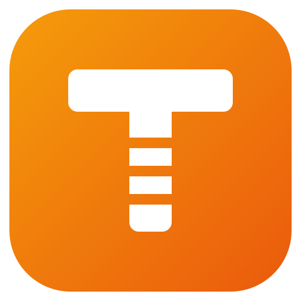

<p align="center">
  
</p>

<h1 align="center">TRAKTION</h1>

<p align="center"><strong>Modular I/O prompting for the VIZION enhancement tool — Be Right on TRAK.</strong></p>

<p align="center">
  <a href="https://github.com/vaseydev/traktion/actions/workflows/ci.yml"></a>
  
  
  
</p>

## What is TRAKTION?

TRAKTION is an experimental I/O prompting tool built to sit alongside **VIZION**, our enhancement tool. Where VIZION enhances, TRAKTION steers: the goal is a set of **modular inputs** through which an enhancement can be **dynamically influenced** — composed per run instead of locked into one monolithic, up-front prompt.

## Status & flags

**Pre-alpha, concept stage.** This repository currently carries the project's documentation, brand assets, and engineering standard; no application code has landed yet.

| Flag | Meaning |
| --- | --- |
| `experimental` | Interfaces, naming, and scope can change without notice. |
| `concept` | Docs and standards only — nothing runnable ships from this repo yet. |
| `companion` | Designed to pair with VIZION, not to stand alone. |
| `modular-io` | Inputs are composed from interchangeable modules, not one fixed prompt. |
| `dynamic` | Built to influence an enhancement while it runs, not only before it starts. |

## Design goals

These are direction, not shipped features:

- **Modular inputs** — prompting building blocks that combine per run.
- **Dynamic influence** — steer the enhancement mid-run through a live input channel.
- **VIZION-native I/O** — the input/output contract is designed around the VIZION enhancement loop from day one.

## Quick start

Nothing to install yet — the fastest way in is the docs:

```bash
git clone https://github.com/vaseydev/traktion.git
cd traktion
bash scripts/gate.sh   # run the repo-standard verification gate
```

## Tech stack & environment

- **Stack:** not selected yet — it will be recorded in [`CLAUDE.md`](CLAUDE.md) Project Notes and here when the first implementation lands.
- **Environment variables:** none yet; a documented `.env.example` lands with the first code that needs one.
- **Architecture:** see [`docs/architecture.md`](docs/architecture.md) for the intended TRAKTION ⇄ VIZION shape.

## Notes & updates

- [`CHANGELOG.md`](CHANGELOG.md) — every meaningful change (Keep a Changelog + SemVer).
- [`docs/notes/`](docs/notes/) — dated working notes (`YYYY-MM-DD-topic.md`).
- [`docs/decisions/`](docs/decisions/) — architecture decision records.

## Contributing

All changes follow the engineering standard in [`CLAUDE.md`](CLAUDE.md). Conduct is governed by the [Code of Conduct](CODE_OF_CONDUCT.md); vulnerabilities go through the [security policy](SECURITY.md), not public issues.

## License

Released into the public domain under [the Unlicense](LICENSE).

---

<p align="center"><sub><strong>VASEY/AI</strong> · AI tooling by Sean Vasey — Vasey Multimedia</sub></p>
