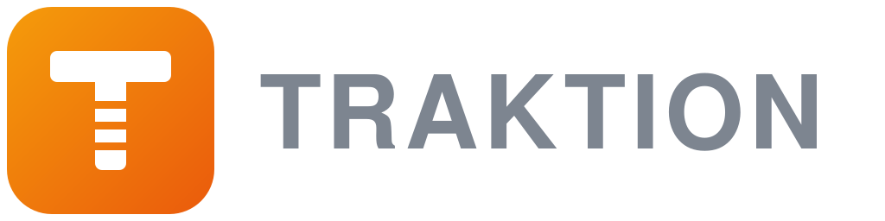
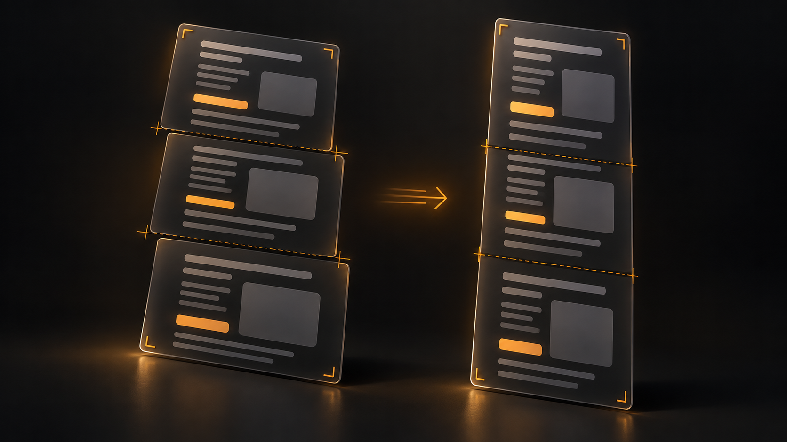
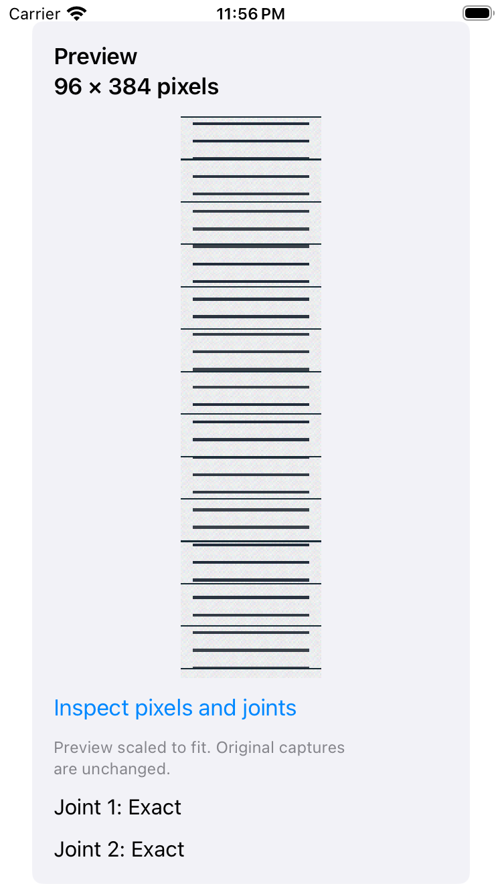
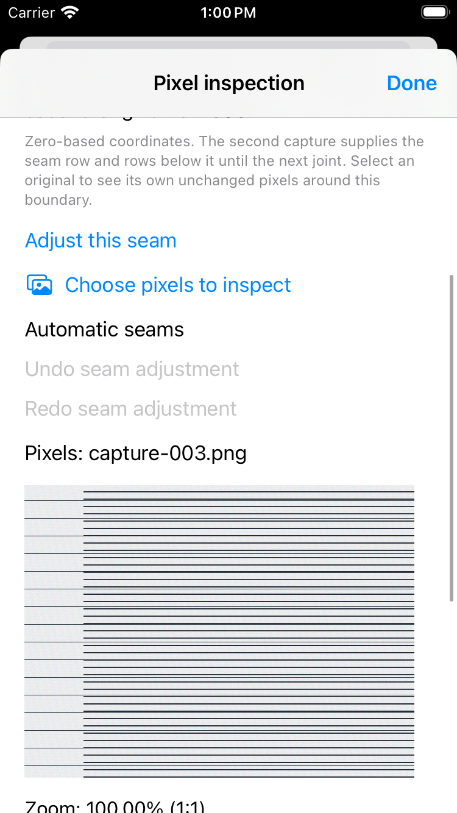
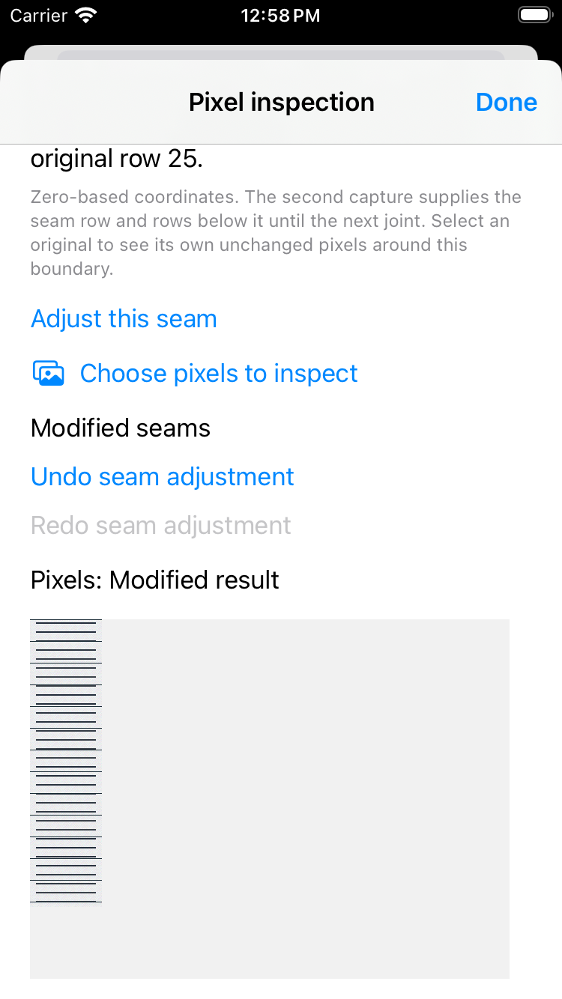
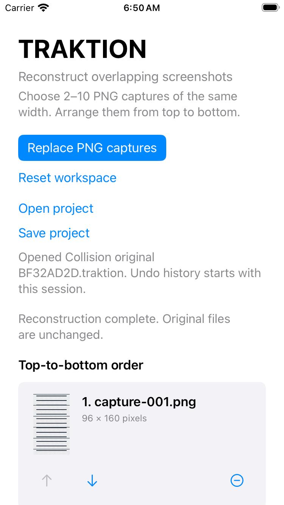

<p align="center">
  
</p>

<h1 align="center">TRAKTION</h1>

<p align="center"><strong>Precision reconstruction for content captured in pieces — Be Right on TRAK.</strong></p>

<p align="center">
  <a href="https://github.com/vaseydev/traktion/actions/workflows/ci.yml"></a>
  
  
  
  
</p>

## What is TRAKTION?

TRAKTION is a native, offline-first utility for turning **overlapping screenshots into one continuous image you can inspect and correct**. Its purpose is to recover the content you captured, preserve the original evidence, and make every join understandable.

The current app imports PNG screenshots, reconstructs them in a confirmed order, exposes the source pixels behind each seam, and saves originals and committed edits in local projects. The longer-term product adds export, scroll-recording reconstruction, and web capture. Those later capabilities are planned, not available in this build.

Full-page capture often fails: content scrolls inside nested frames, headers stay fixed, floating controls cover content, or the source app simply has no full-page capture. Manual stitching is slow because every adjacent capture overlaps and must be aligned and trimmed precisely. TRAKTION's deterministic reconstruction engine does that alignment — and reports what it cannot prove instead of inventing it.

<p align="center">
  
</p>

*Product vision illustration — not an app screenshot or a pixel-accuracy example.
[Verified native screenshots](#actual-app-screenshots) appear below.*

## Status

**Experimental native iOS build.** The reconstruction core, PNG import, bounded
pixel/joint inspection, reversible seam editor, and local project save/open are implemented.
The app is not yet a distribution-ready product: export, device
signing, and broader capture modes remain on the [roadmap](docs/ROADMAP.md).
[Task packets](docs/tasks/README.md) record acceptance evidence and the next work;
[repository health](docs/notes/2026-09-17-repository-health.md) records the CI audit.

| Available in the current build | Scope |
| --- | --- |
| Native PNG workspace | Files import, numbered move/remove controls, explicit order confirmation, atomic replacement and typed failure states |
| Deterministic reconstruction | 2–10 opaque, equal-width PNGs; vertical static content; exact/accepted near-exact translational overlap |
| Pixel and joint inspection | Bounded pan/zoom, 1:1 pixels, original-capture views, seam coordinates and confidence |
| Deliberate seam adjustment | Move inside an already proven overlap; preview, apply/cancel, undo/redo; original captures and registration evidence retained |
| Local projects | Save exact original PNGs, confirmed order and committed seams in one `.traktion` file; reopen through Files with evidence validation and a fresh undo history |
| Ordering tools | Exact and near-exact order recovery in the core and Lab; missing/ambiguous evidence is refused |
| Reproducible diagnostics | Composite/manifest/joint diagnostics, synthetic failure bundles, 45-case evaluation corpus and memory/throughput reports |

### Actual app screenshots

<p align="center">
  
  
</p>
<p align="center">
  
  
</p>

These are unmodified simulator captures from verified editing and persistence
builds using synthetic documents: reconstruction, original-source comparison,
reversible seam adjustment, and a reopened local project. They show actual behavior, not a future design mockup.
[Capture provenance](assets/screenshots/README.md) identifies each test and commit,
including a [reopened committed seam](assets/screenshots/local-project-seam.png).
The established amber logo is retained; production app-icon packaging and visual
polish remain release work.

### What comes next

| Planned feature | Purpose |
| --- | --- |
| PNG export, then broader formats | Publish the exact edited result with clear uncertainty handling; later PDF/JPEG/HEIC and split export |
| More correction tools | Trim/cut, translation correction, difference/edge views, pixel loupe and snapping |
| Fixed viewport recovery | Detect sticky headers, footers and floating controls; recover from genuine alternate-source pixels |
| Scroll Recording and Web Capture | Reconstruct from selected frames and capture difficult scrollable documents |
| Horizontal reconstruction and sharing | Wider capture workflows and a share extension |
| Optional semantic review | One provider behind an interface; recommendations require deterministic validation and never author pixels |

Near-exact similarity alone does not prove documentary continuity. Identical
repeated top/bottom chrome is rejected; general sticky-element recovery and the
broader one-direction ambiguity problem remain explicit limits (ADR-018).

## Design invariants

Contractual, from [`AGENTS.md`](AGENTS.md) — every change is reviewed against them:

- **Deterministic pixels** — deterministic image-processing code owns alignment, seams, rendering, and final pixel selection. An optional semantic reviewer may classify ambiguity; it never authors pixels.
- **No fabrication** — missing coverage is reported, never silently invented or bridged.
- **Non-destructive sources** — original captures are never overwritten; deletion is an explicit user action.
- **Local-first** — core reconstruction, editing, persistence, and export work offline, with no model API.
- **One reviewer provider** — at most one semantic-review provider at runtime, behind an interface.

## Planned modes

Per the [product spec](docs/PRODUCT.md): **Screenshots** (overlapping captures, vertical or horizontal), **Scroll Recording** (frame extraction from screen recordings), and **Web Capture** (native document capture with viewport-reconstruction fallback).

Every joint in a reconstruction carries a confidence state — `exact` · `strong` · `review` · `gap` · `conflict` — and low-confidence states stay visible until resolved, accepted, or exported with an acknowledged warning.

## Quick start

The platform-neutral core uses Swift 6. PNG I/O uses Apple ImageIO on macOS and a deterministic pure-Swift codec elsewhere, behind one contract ([ADR-011](docs/adr/ADR-011-imageio-boundary-pure-swift-fallback.md)) — so the end-to-end PNG smoke runs on any host, and `gate.sh` on macOS additionally verifies the ImageIO path.

```bash
git clone https://github.com/vaseydev/traktion.git
cd traktion
bash scripts/check-repository.sh  # repository policy on any host
python3 -m unittest discover -s Tests/Repository -v  # native test-inventory guard
bash scripts/verify-core.sh       # Swift build + tests on any host
bash scripts/smoke.sh             # fixture → reconstruct → compare on any host
swift run --configuration release traktion-lab evaluate --output /tmp/evaluation-report.json
bash scripts/gate.sh              # complete macOS gate (adds ImageIO verification)
bash scripts/verify-ios.sh        # macOS/Xcode: dedicated simulator build/install/launch/UI tests
```

Generate and reconstruct the baseline fixture:

```bash
swift run fixture-forge baseline --output-dir /tmp/traktion-fixture
swift run traktion-lab reconstruct \
  --output /tmp/traktion-composite.png \
  /tmp/traktion-fixture/capture-001.png \
  /tmp/traktion-fixture/capture-002.png \
  /tmp/traktion-fixture/capture-003.png
swift run traktion-lab compare \
  /tmp/traktion-fixture/source.png \
  /tmp/traktion-composite.png
```

The Lab writes a reconstruction JSON sidecar plus per-joint JSON and absolute-difference PNGs. It refuses to overwrite outputs or turn unsupported/ambiguous evidence into a successful composite.

For the native app, open `App/TRAKTION.xcodeproj` and use its shared `TRAKTION`
scheme with an iPhone simulator. The [iOS runbook](docs/runbooks/ios-development.md)
documents CI reproduction, test evidence, and developer-owned device signing.
Choose **Import PNG captures**, arrange the numbered captures from top to bottom,
confirm the order, and select **Reconstruct locally**. A failed replacement
keeps the previous workspace. Reset/remove only affect the workspace; original
files remain unchanged. Select **Inspect pixels and joints** on the result for
1:1 source pixels, pan/zoom and each joint’s original-capture evidence. The
viewport stays bounded while the full reconstruction remains intact. In a joint,
choose **Adjust this seam**, preview a boundary inside its proven overlap, then apply
or cancel. Undo/redo preserves committed changes across inspector reopening;
reset or replacement clears this in-memory history.

Choose **Save project**, enter a name, then **Choose folder** in Files. Use
**On My iPhone → TRAKTION** for local storage. Each save needs an unused name;
existing files are never overwritten. **Open project** restores
the original captures, confirmed order, automatic evidence and committed seams;
undo/redo starts fresh after reopening. Failed or cancelled opening keeps the
current workspace. Saving excludes uncommitted inspector drafts. There is no
export workflow yet. [Project format and limits](docs/adr/ADR-024-local-project-container.md)
and [save/open instructions](docs/runbooks/ios-development.md#local-projects)
describe compatibility and cancellation behavior.
Some external locations cannot support safe saves; choose the local TRAKTION
folder if a destination is refused.
See [ADR-021](docs/adr/ADR-021-native-png-workspace.md) for input and resource limits.

Captures whose order is unknown can be ordered from byte-exact evidence (`--order exact`) or from uniquely registered near-exact overlaps (`--order near-exact`); missing or ambiguous ordering evidence is a typed failure:

```bash
swift run traktion-lab reconstruct --order exact \
  --output /tmp/traktion-recovered.png \
  /tmp/traktion-fixture/capture-002.png \
  /tmp/traktion-fixture/capture-003.png \
  /tmp/traktion-fixture/capture-001.png
```

## Tech stack & environment

- **Stack:** Swift 6, SwiftPM and Xcode, shared native SwiftUI workspace, Apple ImageIO PNG boundary, dependency-free platform-neutral reconstruction core ([ADR-001](docs/adr/ADR-001-native-swift.md)).
- **Environment variables:** verification supports `TRAKTION_SMOKE_DIR` for synthetic smoke output and `TRAKTION_GOLDEN_ARTIFACTS` for opt-in test failure evidence; see the [verification runbook](docs/runbooks/verification.md). No runtime secrets or model API are needed.
- **Dependencies and CI:** [inventory](docs/DEPENDENCIES.md), [verification runbook](docs/runbooks/verification.md), and [historical failure analysis](docs/notes/2026-09-17-repository-health.md). No external Swift package dependency.
- **Architecture:** module boundaries and data flow in [`docs/ARCHITECTURE.md`](docs/ARCHITECTURE.md); layout in [`docs/REPO_LAYOUT.md`](docs/REPO_LAYOUT.md).

## Notes & updates

- [`CHANGELOG.md`](CHANGELOG.md) — every meaningful change (Keep a Changelog + SemVer).
- [`docs/notes/`](docs/notes/) — dated working notes (`YYYY-MM-DD-topic.md`).
- [`docs/adr/`](docs/adr/) — product/architecture ADRs · [`docs/decisions/`](docs/decisions/) — repo-governance ADRs.
- [`docs/tasks/`](docs/tasks/README.md) — tracked task packets with status; [`docs/ROADMAP.md`](docs/ROADMAP.md) — milestone status.

## Contributing

[`AGENTS.md`](AGENTS.md) is the canonical contract for all contributors and coding agents. Conduct is governed by the [Code of Conduct](CODE_OF_CONDUCT.md); vulnerabilities go through the [security policy](SECURITY.md), not public issues — the app's own security and privacy constraints live in [`docs/SECURITY.md`](docs/SECURITY.md) and [`docs/PRIVACY.md`](docs/PRIVACY.md).

Contributions are accepted on the understanding that the project will relicense to MIT when it goes open source — by contributing you grant the maintainer the right to include your contribution under that future license.

## License

Source-available under the [PolyForm Noncommercial License 1.0.0](LICENSE): read, use, modify, and share it for any noncommercial purpose; commercial use is reserved while the project incubates. The plan of record is to relicense under MIT at public open-sourcing (see [`docs/decisions/0002-license-polyform-pending-mit.md`](docs/decisions/0002-license-polyform-pending-mit.md)).

> Required Notice: Copyright 2026 Sean Vasey

---

<p align="center"><sub><strong>VASEY/AI</strong> · AI tooling by Sean Vasey · a Vasey Studios project</sub></p>
